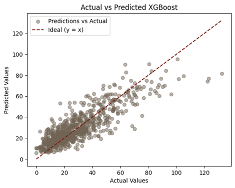
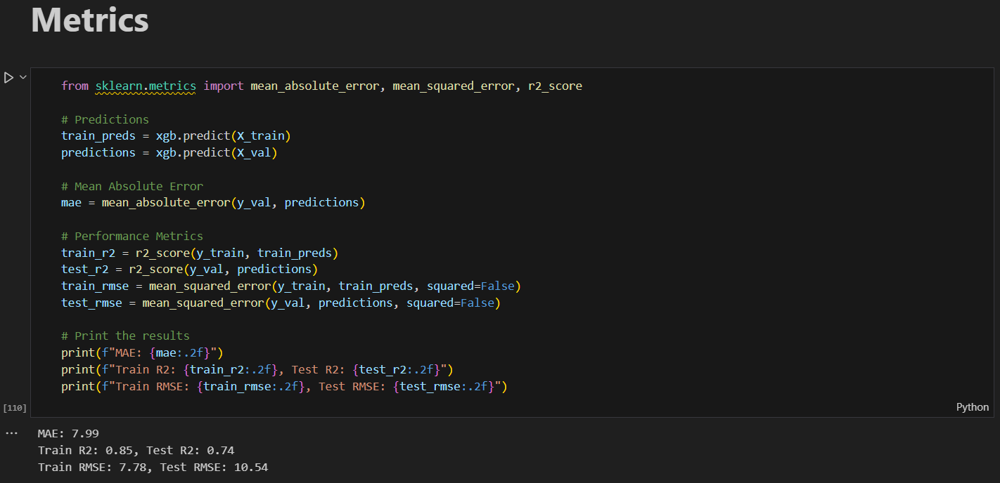

<html lang="en">
<head>
  <meta charset="UTF-8">
  <title>Kaike Vieira – Data Analyst & BI Portfolio</title>
  <meta name="viewport" content="width=device-width, initial-scale=1">

  <!-- Font Awesome Icons -->
  <link rel="stylesheet" href="https://cdnjs.cloudflare.com/ajax/libs/font-awesome/6.4.0/css/all.min.css" />

  <!-- Optional: Google Font -->
  <link href="https://fonts.googleapis.com/css2?family=Inter:wght@400;600;700&display=swap" rel="stylesheet">

  
</head>

<body>

<!-- Hero Section -->
<section class="hero">
  <h1>Kaike Vieira</h1>
  
Data & Business Intelligence Analyst | Process Optimizer

  
Transforming complex data into actionable insights using Power BI, SQL, Python, and Excel.

  

    <a href="https://www.linkedin.com/in/kaikevieira/" class="button-link"><i class="fab fa-linkedin"></i> LinkedIn</a>
    <a href="https://github.com/kaikesvieira" class="button-link"><i class="fab fa-github"></i> GitHub</a>
  

</section>

<!-- About Section -->
<section style="background-color: #f7f7f7;">
  <h2><i class="fas fa-user"></i> About Me</h2>
  

    With over 4 years of experience in both engineering and analytics roles, I’ve developed a keen eye for optimizing processes and delivering data-driven results. I hold a Graduate Certificate in Data Analytics for Business from St. Clair College and a degree in Mechanical Engineering from a Brazilian university.
  

  

    Currently, I work for the City of Windsor and COBS Bread, where I manage workforce data and analyze daily sales trends while assisting customers. My past experience includes building KPIs and dashboards in SQL, Excel, and Power BI to reduce equipment failure and improve operations.
  

</section>

<!-- Portfolio Section -->
<section>
  <h2><i class="fas fa-chart-line"></i> Featured Projects</h2>

  

    <h3>📦 Sales Forecasting – E-Grocery Industry</h3>
    <!-- Project Thumbnail -->
    
    

      This project forecasts 14-day sales for a grocery warehouse in Frankfurt using advanced time series modeling. The goal was to reduce waste and improve inventory planning by capturing seasonal, promotional, and weather-driven sales patterns.
    

    

      <strong>Key Insights:</strong> Sales peaked on Fridays and dipped during holidays or store closures. Discounts often boosted sales but did not show a direct linear correlation. The "Fruit and Vegetables" category dominated total sales. Recursive Feature Elimination proved critical in selecting engineered features that significantly improved model performance.
    

      

      <strong>Conclusion:</strong> XGBoost outperformed LightGBM in accuracy, achieving the lowest MAE and strongest R², but showed mild overfitting on high sales volumes. The combination of lag features, Fourier transforms, and calendar effects led to high model interpretability. This approach provides a scalable foundation for real-world sales forecasting in retail environments.
    

      <ul>
      <li><strong>Objective:</strong> Predict sales with high accuracy to reduce overstocking/understocking.</li>
      <li><strong>Data:</strong> Historical sales (2 years), calendar (holidays), inventory, weather (Visual Crossing API)</li>
      <li><strong>Features:</strong> Lag (7, 14, 365), rolling means, Fourier transforms, target & one-hot encoding</li>
      <li><strong>Models:</strong> XGBoost (best), LightGBM</li>
      <li><strong>Tech Stack:</strong> Python, Scikit-learn, Optuna, Google Colab, VS Code</li>
      <li><a href="https://github.com/kaikesvieira/kaikevieira-data-portfolio/tree/main/sales-forecasting-egrocery">View on GitHub</a></li>
    </ul>
      <!-- Code Thumbnail -->
    
      <!-- Download Button -->
    <a href="https://github.com/kaikesvieira/kaikevieira-data-portfolio/blob/main/sales-forecasting-egrocery/Final_Project_Report.docx" class="button-link" style="margin-top: 1rem; display: inline-block;">
      📄 Download Project Report
    </a>
  

  

    <h3>💰 Financial Analysis – Canadian Banks (Interactive Dashboard)</h3>
    <iframe title="FinancialAnalyticsProject" width="100%" height="425" 
            src="https://app.powerbi.com/reportEmbed?reportId=7a32fe36-1292-4b56-97b2-4c39ea346a71&autoAuth=true&ctid=c986676f-9b39-4d08-b4f8-a668e0e8c6a5" 
            frameborder="0" allowFullScreen="true"></iframe>
    

      Performed descriptive financial analysis of Canada's Big 5 Banks using Power BI and Alpha Vantage API. 
      Transformed raw API data into structured tables and created interactive dashboards visualizing profitability, growth trends, and bank comparisons.
    

    <ul>
      <li><strong>Tools:</strong> Power BI, DAX, Alpha Vantage API, Excel</li>
      <li><a href="https://github.com/kaikesvieira/kaikevieira-data-portfolio/tree/main/financial-powerbi-big5-analysis">View Project on GitHub</a></li>
      <li><a href="https://github.com/kaikesvieira/kaikevieira-data-portfolio/blob/main/financial-powerbi-big5-analysis/Big5CanadianBanks_Presentation.pptx">View Project Presentation</a></li>
    </ul>
  

</section>

<!-- Resume Section -->
<section style="background-color: #f0f0f0;">
  <h2><i class="fas fa-briefcase"></i> Resume Highlights</h2>
  <ul>
    <li><strong>Current Roles:</strong> Timekeeper (City of Windsor), Sales Assistant (COBS Bread)</li>
    <li><strong>Technical Tools:</strong> Power BI, Python, SQL, Excel, Git, SharePoint</li>
    <li><strong>Certifications:</strong> AWS Cloud Practitioner, Google Data Analytics</li>
    <li><strong>Education:</strong> St. Clair College (Data Analytics), Universidade Paulista (Engineering)</li>
  </ul>
</section>

<!-- Call to Action -->
<section style="text-align: center; background-color: #e8f0fe;">
  <h2><i class="fas fa-envelope"></i> Let’s Connect</h2>
  
If you're looking for a motivated data analyst who can bring clarity to your data and communicate findings effectively—let’s talk!

  <a href="mailto:vieirakaike@icloud.com" class="button-link"><i class="fas fa-paper-plane"></i> Email Me</a>
  <a href="https://www.linkedin.com/in/kaikevieira/" class="button-link"><i class="fab fa-linkedin"></i> LinkedIn</a>
</section>

<!-- Footer -->
<footer>
  © 2025 Kaike Vieira. All rights reserved.
</footer>

</body>
</html>

